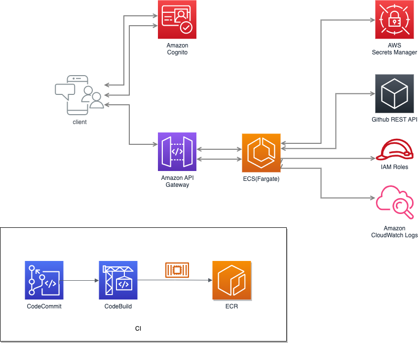

# Test Task for TUI Project

## Overview
The following repo contains test api example for VCS (GitHub) 

## Build & Test project

> mvn clean install

## Build docker image
> docker build --tag tui-task-api:local .
> 
> docker run -p 8080:8080 tui-task-api:local

## REST Endpoints 
> GET http://localhost:8080/v1/user/{username}/repos

## License
No license for now

## Support
Please enter an issue in the repo for any questions or problems.
  Alternatively, please contact us at support@test.com